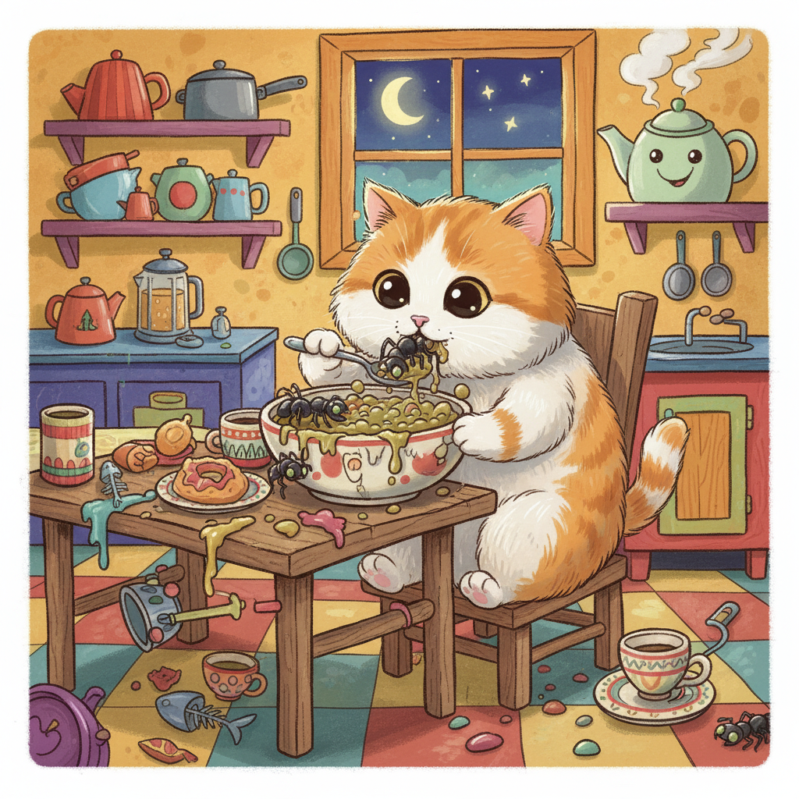

<!-- catSlop-1772991800145 - A collection of AI-generated images depicting cats eating dangerous insects from slop bowls. -->

# 🐱 catSlop-1772991800145

[](./images)
[](#)
[](#)

A curated collection of **95 AI-generated images** depicting cats eating dangerous insects out of slop bowls. Each image features a different hazardous insect species — from black widow spiders to deathstalker scorpions — being consumed by a cat from a slop bowl.

> **⚠️ Disclaimer:** These images are entirely AI-generated. No real cats or insects were involved. Do not feed dangerous insects to cats (or anyone else).

---

## 📖 About

This repository was auto-generated on **2026-03-08T17:43:20.145Z** and contains a set of PNG images stored in the `images/` directory. Each filename follows a consistent naming convention:

```
cat_eating_{insect_name}_{id}_{batch_id}.png
```

The collection spans a wide range of dangerous, venomous, parasitic, and otherwise hazardous arthropods paired with cats in a surreal slop-bowl dining scenario.

---

## 📁 Project Structure

```
catSlop-1772991800145/
├── README.md
└── images/
    ├── cat_eating_black_widow_spider_1_1772991800145.png
    ├── cat_eating_brown_recluse_spider_2_1772991800145.png
    ├── cat_eating_bullet_ant_3_1772991800145.png
    ├── cat_eating_fire_ant_4_1772991800145.png
    ├── cat_eating_army_ant_5_1772991800145.png
    ├── ... (95 images total)
    └── cat_eating_gypsy_moth_caterpillar_95_1772991800145.png
```

---

## 🕷️ Insect Categories

The 95 images cover the following categories of dangerous arthropods:

### Arachnids & Scorpions
| Species | File |
|---|---|
| Black Widow Spider | `cat_eating_black_widow_spider_1_*.png` |
| Brown Recluse Spider | `cat_eating_brown_recluse_spider_2_*.png` |
| Scorpion | `cat_eating_scorpion_26_*.png` |
| Bark Scorpion | `cat_eating_bark_scorpion_27_*.png` |
| Emperor Scorpion | `cat_eating_emperor_scorpion_28_*.png` |
| Deathstalker Scorpion | `cat_eating_deathstalker_scorpion_29_*.png` |
| Fat-tailed Scorpion | `cat_eating_fat-tailed_scorpion_30_*.png` |
| Tick | `cat_eating_tick_88_*.png` |
| Mite | `cat_eating_mite_89_*.png` |
| Chigger | `cat_eating_chigger_87_*.png` |

### Ants (Venomous & Aggressive)
| Species | File |
|---|---|
| Bullet Ant | `cat_eating_bullet_ant_3_*.png` |
| Fire Ant | `cat_eating_fire_ant_4_*.png` |
| Army Ant | `cat_eating_army_ant_5_*.png` |
| Velvet Ant | `cat_eating_velvet_ant_66_*.png` |
| Driver Ant | `cat_eating_driver_ant_67_*.png` |
| Leafcutter Ant | `cat_eating_leafcutter_ant_68_*.png` |
| Trap Jaw Ant | `cat_eating_trap_jaw_ant_69_*.png` |
| Weaver Ant | `cat_eating_weaver_ant_70_*.png` |

### Wasps & Bees
| Species | File |
|---|---|
| Asian Giant Hornet | `cat_eating_asian_giant_hornet_6_*.png` |
| Yellowjacket Wasp | `cat_eating_yellowjacket_wasp_7_*.png` |
| Paper Wasp | `cat_eating_paper_wasp_8_*.png` |
| Tarantula Hawk Wasp | `cat_eating_tarantula_hawk_wasp_9_*.png` |
| Cicada Killer Wasp | `cat_eating_cicada_killer_wasp_10_*.png` |
| Africanized Honey Bee | `cat_eating_africanized_honey_bee_41_*.png` |
| Carpenter Bee | `cat_eating_carpenter_bee_42_*.png` |
| Sweat Bee | `cat_eating_sweat_bee_43_*.png` |
| Mining Bee | `cat_eating_mining_bee_44_*.png` |
| Leafcutter Bee | `cat_eating_leafcutter_bee_45_*.png` |

### Mosquitoes & Flies
| Species | File |
|---|---|
| Mosquito | `cat_eating_mosquito_21_*.png` |
| Malaria Mosquito | `cat_eating_malaria_mosquito_22_*.png` |
| Tiger Mosquito | `cat_eating_tiger_mosquito_23_*.png` |
| Yellow Fever Mosquito | `cat_eating_yellow_fever_mosquito_24_*.png` |
| Marsh Mosquito | `cat_eating_marsh_mosquito_25_*.png` |
| Tsetse Fly | `cat_eating_tsetse_fly_16_*.png` |
| Bot Fly | `cat_eating_bot_fly_17_*.png` |
| Horse Fly | `cat_eating_horse_fly_18_*.png` |
| Deer Fly | `cat_eating_deer_fly_19_*.png` |
| Sand Fly | `cat_eating_sand_fly_20_*.png` |
| Black Fly | `cat_eating_black_fly_61_*.png` |
| Blow Fly | `cat_eating_blow_fly_62_*.png` |
| Cluster Fly | `cat_eating_cluster_fly_63_*.png` |
| Drain Fly | `cat_eating_drain_fly_64_*.png` |
| Flesh Fly | `cat_eating_flesh_fly_65_*.png` |

### Bugs & Beetles
| Species | File |
|---|---|
| Kissing Bug | `cat_eating_kissing_bug_11_*.png` |
| Assassin Bug | `cat_eating_assassin_bug_12_*.png` |
| Giant Water Bug | `cat_eating_giant_water_bug_13_*.png` |
| Wheel Bug | `cat_eating_wheel_bug_14_*.png` |
| Bed Bug | `cat_eating_bed_bug_15_*.png` |
| Japanese Beetle | `cat_eating_Japanese_beetle_36_*.png` |
| Blister Beetle | `cat_eating_blister_beetle_37_*.png` |
| Bombardier Beetle | `cat_eating_bombardier_beetle_38_*.png` |
| Stag Beetle | `cat_eating_stag_beetle_39_*.png` |
| Longhorn Beetle | `cat_eating_longhorn_beetle_40_*.png` |
| Brown Marmorated Stink Bug | `cat_eating_brown_marmorated_stink_bug_71_*.png` |
| Shield Bug | `cat_eating_shield_bug_72_*.png` |
| Harlequin Bug | `cat_eating_harlequin_bug_73_*.png` |
| Squash Bug | `cat_eating_squash_bug_74_*.png` |
| Boxelder Bug | `cat_eating_boxelder_bug_75_*.png` |

### Cockroaches
| Species | File |
|---|---|
| Cockroach | `cat_eating_cockroach_51_*.png` |
| Hissing Cockroach | `cat_eating_hissing_cockroach_52_*.png` |
| American Cockroach | `cat_eating_american_cockroach_53_*.png` |
| German Cockroach | `cat_eating_german_cockroach_54_*.png` |
| Death Head Cockroach | `cat_eating_death_head_cockroach_55_*.png` |

### Mantises
| Species | File |
|---|---|
| Praying Mantis | `cat_eating_praying_mantis_46_*.png` |
| Giant Mantis | `cat_eating_giant_mantis_47_*.png` |
| Orchid Mantis | `cat_eating_orchid_mantis_48_*.png` |
| Ghost Mantis | `cat_eating_ghost_mantis_49_*.png` |
| Dead Leaf Mantis | `cat_eating_dead_leaf_mantis_50_*.png` |

### Centipedes
| Species | File |
|---|---|
| Centipede | `cat_eating_centipede_31_*.png` |
| Giant Centipede | `cat_eating_giant_centipede_32_*.png` |
| House Centipede | `cat_eating_house_centipede_33_*.png` |
| Tiger Centipede | `cat_eating_tiger_centipede_34_*.png` |
| Red-headed Centipede | `cat_eating_red-headed_centipede_35_*.png` |

### Locusts
| Species | File |
|---|---|
| Locust | `cat_eating_locust_56_*.png` |
| Desert Locust | `cat_eating_desert_locust_57_*.png` |
| Migratory Locust | `cat_eating_migratory_locust_58_*.png` |
| Plague Locust | `cat_eating_plague_locust_59_*.png` |
| Red Locust | `cat_eating_red_locust_60_*.png` |

### Caterpillars
| Species | File |
|---|---|
| Io Moth Caterpillar | `cat_eating_io_moth_caterpillar_91_*.png` |
| Saddleback Caterpillar | `cat_eating_saddleback_caterpillar_92_*.png` |
| Puss Caterpillar | `cat_eating_puss_caterpillar_93_*.png` |
| Hickory Tussock Moth Caterpillar | `cat_eating_hickory_tussock_moth_caterpillar_94_*.png` |
| Gypsy Moth Caterpillar | `cat_eating_gypsy_moth_caterpillar_95_*.png` |

### Other Arthropods
| Species | File |
|---|---|
| Earwig | `cat_eating_earwig_76_*.png` |
| Silverfish | `cat_eating_silverfish_77_*.png` |
| Firebrat | `cat_eating_firebrat_78_*.png` |
| Thrip | `cat_eating_thrip_79_*.png` |
| Mealybug | `cat_eating_mealybug_80_*.png` |
| Dobsonfly | `cat_eating_dobsonfly_81_*.png` |
| Antlion | `cat_eating_antlion_82_*.png` |
| Lacewing | `cat_eating_lacewing_83_*.png` |
| Mayfly | `cat_eating_mayfly_84_*.png` |
| Caddisfly | `cat_eating_caddisfly_85_*.png` |
| Flea | `cat_eating_flea_86_*.png` |
| Louse | `cat_eating_louse_90_*.png` |

---

## 🖼️ Usage

### Browsing the Images

Clone the repository and browse the `images/` directory:

```bash
git clone https://github.com/farmrecipes67/catSlop-1772991800145.git
cd catSlop-1772991800145/images
```

### Embedding in Markdown

To reference an image from this repository:

```markdown

```

### Direct URL

Images can be referenced directly via GitHub raw URLs:

```
https://raw.githubusercontent.com/farmrecipes67/catSlop-1772991800145/main/images/cat_eating_bullet_ant_3_1772991800145.png
```

---

## 📊 Stats

| Metric | Value |
|---|---|
| **Total Images** | 95 |
| **Format** | PNG |
| **Batch ID** | `1772991800145` |
| **Generated** | 2026-03-08T17:43:20.145Z |
| **Last Updated** | 2026-03-08T17:51:34Z |
| **Insect Categories** | 13+ |
| **Unique Species** | 95 |

---

## ⚠️ Notes

- All images in this repository are **AI-generated** and do not depict real events.
- This repository contains **no executable code** — it is purely an image collection.
- Image content is surreal/absurdist in nature and intended for entertainment or creative use.
- The repository is **public** and freely accessible.

---

## 📄 License

No license has been specified for this repository. Please contact the repository owner at [farmrecipes67](https://github.com/farmrecipes67) for usage permissions.

---

<p align="center"><sub>🤖 This README was auto-generated. Last updated: 2026-03-08</sub></p>